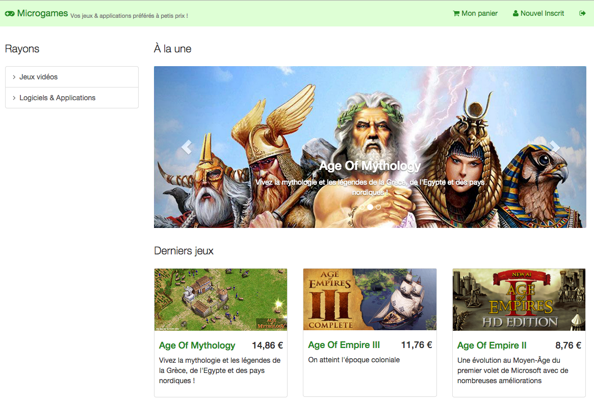

# Microgames - django powered e-commerce

## Licence

- Ce projet est placé sous licence GNU AGPL v.3.0

## Prérequis techniques

- Django >= 1.7
- module django-bootstrap3
- module stripe

voir *Requirement.txt*

## Fonctionnalités implémentées

- Page d'accueil listant 5 produits
- Page permettant de voir les produits contenus dans la catégorie (et les catégories filles)
- Page de connexion/inscription
- Panier de produits
- Paiement

### Gestion du panier

- Le panier est géré en mode connecté et non connecté : l'utilisateur n'a pas besoin d'être inscrit pour ajouter des produits à son panier.
- Lorsque l'utilisateur s'identifie, les éventuels produits dans le panier "non connecté" sont transférés dans le panier de l'utilisateur.

### Gestion du paiement

- Le paiement est géré par le prestataire tiers Stripe.
- Il est possible de tester un paiement avec le numéro de carte bancaire factice "4242 4242 4242 4242", la date d'expiration "10/16" et le cryptogramme "111".
- Une fois la transaction validée, elle apparaît dans le tableau de bord sur Stripe.com

### Tests unitaires/d'intégration

- Une grande partie de l'application a été testée de façon unitaire :
    - couverture de code de **68%** pour *views.py*
    - couverture de code de **94%** pour *models.py*

## Screenshots

D'autres captures dans le répertoire **screenshots/**